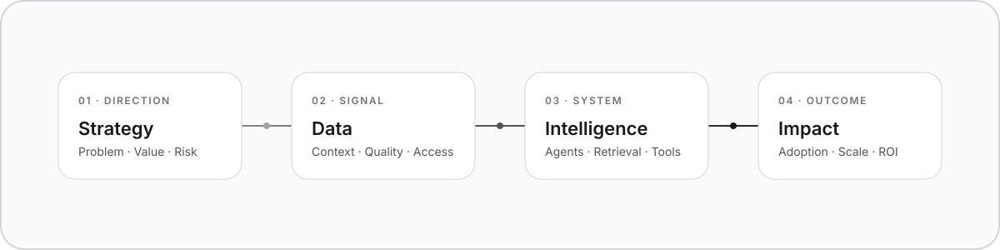

<div align="center">

<picture>
  <source media="(prefers-color-scheme: dark)" srcset="./assets/hero-dark.svg">
  <source media="(prefers-color-scheme: light)" srcset="./assets/hero-light.svg">
  
</picture>

<br/>

<a href="mailto:rezaghaemijob@gmail.com">Email</a>&nbsp;&nbsp;·&nbsp;&nbsp;<a href="https://github.com/Rezaghaemi21">GitHub</a>&nbsp;&nbsp;·&nbsp;&nbsp;<a href="https://buymeacoffee.com/RezaGh">Support</a>

</div>

<br/>

## Building at the intersection of intelligence and execution.

I’m an AI systems architect and technical founder based in Vienna. I design production-grade AI platforms that connect **strategy, data, architecture, and automation** — with a strong focus on real-world adoption, governance, and measurable outcomes.

My work lives where ambitious product ideas meet the constraints of enterprise systems.

<br/>

<picture>
  <source media="(prefers-color-scheme: dark)" srcset="./assets/system-dark.svg">
  <source media="(prefers-color-scheme: light)" srcset="./assets/system-light.svg">
  
</picture>

<br/>

## Current focus

<table>
<tr>
<td width="33%" valign="top">

**01 — Agentic Systems**

Multi-agent orchestration, tool use, workflow automation, guardrails, evaluation, and human-in-the-loop operations.

</td>
<td width="33%" valign="top">

**02 — Knowledge Architecture**

RAG, semantic retrieval, knowledge graphs, structured context, and reliable decision support over complex data.

</td>
<td width="33%" valign="top">

**03 — AI Transformation**

Turning business strategy into scalable platforms — from architecture and governance to production rollout and impact.

</td>
</tr>
</table>

<br/>

## How I work

```text
01  Start with the business constraint, not the model.
02  Design for production, observability, and governance from day one.
03  Keep intelligence modular — orchestration and inference should evolve independently.
04  Measure outcomes, not AI theatre.
```

<br/>

## Core domains

| AI & ML | Platform Engineering | Strategy |
|:---|:---|:---|
| Agentic AI | Distributed Systems | Product Strategy |
| LLM Engineering | Event-Driven Architecture | AI Transformation |
| RAG / Vector Search | API Design | Technical Due Diligence |
| AI Governance | Scalable Infrastructure | Digital Transformation |
| Knowledge Graphs | Observability & Monitoring | Go-to-Market Strategy |
| Multi-Agent Orchestration | CI/CD & DevOps | Stakeholder Alignment |

<br/>

## Selected work

Much of my current work is private by design: AI-native recruiting systems, enterprise automation platforms, decision-support architecture, and data-intensive internal products.

I’m always open to conversations around **AI architecture, technical strategy, product partnerships, and high-leverage systems**.

<br/>

<div align="center">

<sub>VIENNA, AUSTRIA · BUILDING SYSTEMS THAT MOVE FROM SIGNAL TO IMPACT</sub>

</div>
